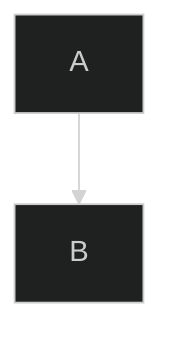

# CLAUDE.md

This file provides guidance to Claude Code (claude.ai/code) when working with code in this repository.

## 项目概述

Claude Code 技能项目，提供从 Markdown 文件提取 Mermaid 图表并生成高质量 PNG/SVG 图像的功能，支持直接从 Mermaid 代码生成图表和主题定制。

## 核心工作流

### 1. 批量提取并生成图表

从 Markdown 文件提取所有 Mermaid 图表并生成图像：

```bash
cd scripts
./extract-and-generate.sh "<markdown_file>" "<output_directory>"
```

输出示例：`01-diagram-name.mmd` + `01-diagram-name.png/svg`

### 2. 直接生成单个图表

从 Mermaid 代码或 `.mmd` 文件直接生成图像：

```bash
cd scripts

# 代码 → PNG
./generate-diagram.sh "graph TD; A-->B;" "output.png"

# 文件 → SVG
./generate-diagram.sh "diagram.mmd" "output.svg"
```

### 3. 主题和格式定制

```bash
cd scripts

# 深色主题
MERMAID_THEME=dark ./generate-diagram.sh "graph TD; A-->B;" "output.png"

# SVG 格式
MERMAID_FORMAT=svg ./extract-and-generate.sh "doc.md" "diagrams"

# 组合使用
MERMAID_THEME=forest MERMAID_FORMAT=svg MERMAID_WIDTH=2400 \
  ./generate-diagram.sh "graph LR;" "output"
```

## 环境变量

| 变量 | 默认值 | 说明 |
|------|--------|------|
| `MERMAID_FORMAT` | png | 输出格式：png 或 svg |
| `MERMAID_WIDTH` | 1200 | 基础宽度（像素）|
| `MERMAID_HEIGHT` | 800 | 基础高度（像素）|
| `MERMAID_SCALE` | 2 | PNG 缩放因子 |
| `MERMAID_THEME` | default | 主题：default, forest, dark, neutral, night |

## 依赖验证

```bash
mmdc --version                    # mermaid-cli
google-chrome-stable --version    # Chrome
python3 --version                 # Python 3
```

缺少依赖见 `references/setup_and_troubleshooting.md`。

## 脚本架构

### extract-and-generate.sh（批量提取）

1. 验证依赖
2. 调用 `extract_diagrams.py` 提取 Mermaid 代码块
3. 应用主题配置（注入 `%%{init: {'theme':'xxx'}}%%`）
4. 为每个图表生成 PNG/SVG
5. 验证输出

### generate-diagram.sh（直接生成）

1. 接受 Mermaid 代码或 `.mmd` 文件作为输入
2. 应用主题配置
3. 智能尺寸调整（检测图表类型）
4. 生成 PNG/SVG
5. 验证输出

### extract_diagrams.py（提取工具）

从 Markdown 提取 ` ```mermaid ` 代码块，按顺序命名生成 `.mmd` 文件。

命名策略：特定描述 → 章节标题 → 默认编号

### puppeteer-config.json

WSL2 环境的 Chrome 启动参数（no-sandbox、disable-gpu 等）。

## 重要原则

### 始终从 scripts 目录运行

所有脚本依赖同目录下的文件，必须先切换到 `scripts/` 目录：

```bash
cd ~/.claude/skills/mermaid-tools/scripts
./[script-name].sh [arguments]
```

### 主题应用机制

脚本通过在 Mermaid 代码前注入主题指令实现主题切换：



如果代码中已包含 `%%{init:...}%%`，脚本会跳过主题注入。

### 智能尺寸调整

根据文件名或内容检测图表类型并自动调整尺寸：

| 类型 | 尺寸 |
|------|------|
| timeline/gantt | 2400×400 |
| architecture/system/caching | 2400×1600 |
| monitoring/workflow/sequence/api | 2400×800 |
| 默认 | 1200×800 |

## 故障排除

### 权限被拒绝
```bash
chmod +x scripts/*.sh
```

### 输出质量低
```bash
MERMAID_SCALE=3 ./generate-diagram.sh "graph TD; A-->B;" "output.png"
```

### Chrome 错误
验证 WSL2 依赖已安装（见 `references/setup_and_troubleshooting.md`）

### 找不到图表
1. 验证 Markdown 包含 ` ```mermaid ` 代码块
2. 检查文件路径正确
3. 确保代码块格式正确

## 参考文档

`references/setup_and_troubleshooting.md` - 完整的依赖安装、环境变量和故障排除指南。
